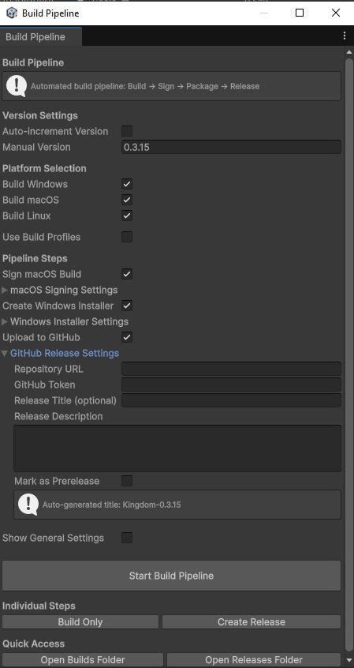

# Unity GitHub Build Automation

Build automation pipeline for desktop platforms in Unity with versioned GitHub releases.

## Features

- Automated Unity build process for desktop platforms (Windows, macOS, Linux)
- Automated versioning (Major.Minor.Build)
- MacOS build signing
- Windows installer creation
- Build .zip bundler
- Versioned GitHub Releases generation
- Update Checker for runtime application updates

### Requirements

- Unity 6.0 or later supporting build profiles.
- Publishing to a private reposititory requires GitHub Personal Access Token (PAT) with `repo` and `workflow` permissions
- [Inno-Setup](https://jrsoftware.org/isinfo.php) installed to create windows installation files. Default path: C:\Program Files (x86)\Inno Setup 6\ISCC.exe 
- Windows, MacOS, Linux build support installed as needed for your Unity version.

## Getting Started

- Install the latest Unity package found in the releases section by dragging it into Unity's Assets folder.
- Select Build > Build Pipeline from the Unity Toolbar to open the build pipeline window.
- Optionally select build profiles for each platform, otherwise will use the project setting's build profile.
- Select the platforms you wish to build for.
- Optionally input information to sign the MacOS build or create a windows installer.
- Once configured click 'Start Build Pipeline' to build for all platforms & upload to GitHub Releases

## Output

- Outputs builds to a 'Builds' folder at the project root. Builds will be in a folder labeled {ProductName-Platform}
- Outputs Releases to a 'Releases' folder at the project root. Releases will be in .zip files with the build folder names inside a folder named after the version.
- GitHub releases will have a new tag created with the current application version. Only Released files will be uploaded, including .iss files and windows installer called {ProductName-Installer}.exe

## Screenshot

Below is a preview of the Unity build pipeline in action:

## Contributing

Contributions are welcome! Please open issues or pull requests for enhancements, bug fixes, or questions.

## License

This project is licensed under the MIT License. See the [LICENSE](LICENSE) file for details.
